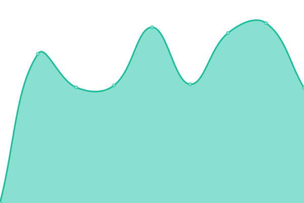
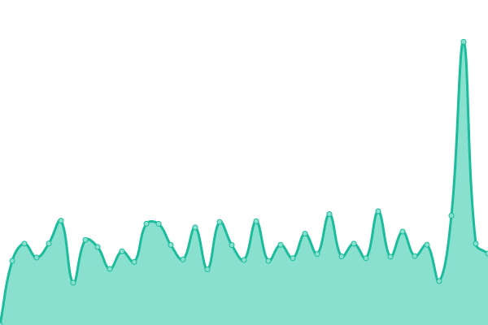

# [📈 Live Status](https://momo31.github.io): <!--live status--> **🟩 All systems operational**

This repository contains the open-source uptime monitor and status page for [momo31](https://momo31.github.io), powered by [Upptime](https://github.com/upptime/upptime).

With [Upptime](https://upptime.js.org), you can get your own unlimited and free uptime monitor and status page, powered entirely by a GitHub repository. We use [Issues](https://github.com/momo31/upptime/issues) as incident reports, [Actions](https://github.com/momo31/upptime/actions) as uptime monitors, and [Pages](https://momo31.github.io) for the status page.

<!--start: status pages-->
<!-- This summary is generated by Upptime (https://github.com/upptime/upptime) -->
<!-- Do not edit this manually, your changes will be overwritten -->
<!-- prettier-ignore -->
| URL | Status | History | Response Time | Uptime |
| --- | ------ | ------- | ------------- | ------ |
|  [fresh](https://fresh.haccp.or.kr) | 🟩 Up | [fresh.yml](https://github.com/momo31/upptime/commits/HEAD/history/fresh.yml) | 

 1184ms
     
 | 

<a href="https://momo31.github.io/history/fresh">99.77%</a>
    

|  [haccp](https://www.haccp.or.kr) | 🟩 Up | [haccp.yml](https://github.com/momo31/upptime/commits/HEAD/history/haccp.yml) | 

 3842ms
     
 | 

<a href="https://momo31.github.io/history/haccp">99.71%</a>
    

|  [shp](https://fresh.haccp.or.kr/shp/shp/guest/main/mainIndex.do) | 🟩 Up | [shp.yml](https://github.com/momo31/upptime/commits/HEAD/history/shp.yml) | 

 1017ms
     
 | 

<a href="https://momo31.github.io/history/shp">100.00%</a>
    

<!--end: status pages-->

[**Visit our status website →**](https://momo31.github.io)

## 📄 License

- Powered by: [Upptime](https://github.com/upptime/upptime)
- Code: [MIT](./LICENSE) © [momo31](https://momo31.github.io)
- Data in the `./history` directory: [Open Database License](https://opendatacommons.org/licenses/odbl/1-0/)
